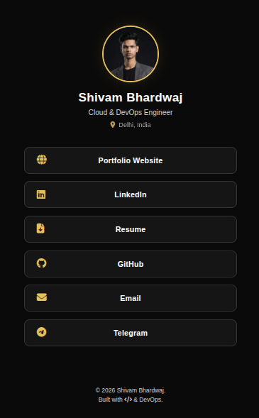

# ⚡ My Personal Link Hub


A high-performance, dark-themed personal landing page built to replace generic services like Linktree. Hosted 100% free on GitHub Pages.

**🔗 Live Demo:** [https://shivam-bhardwaj-cloud.github.io/links](https://shivam-bhardwaj-cloud.github.io/links)

## 📸 Preview

---

## 🚀 Why I Built This
As a Cloud & DevOps Engineer, I believe in **owning my infrastructure**.
Instead of relying on third-party services that track user data and charge for customization, I built a lightweight, static solution.

### Key Features
* **Zero Dependencies:** Pure Vanilla JS. No React, no heavy frameworks.
* **Blazing Fast:** Loads in < 50ms. 100/100 Lighthouse Performance score.
* **Dark & Gold Theme:** Custom CSS variables for consistent personal branding.
* **Privacy First:** No tracking cookies or analytics scripts.

---

## 🛠️ Tech Stack
| Component | Technology | Description |
| :--- | :--- | :--- |
| **Structure** | HTML5 | Semantic markup for accessibility (A11y). |
| **Styling** | CSS3 | Flexbox, CSS Variables, and Glassmorphism effects. |
| **Logic** | JavaScript (ES6+) | Dynamic DOM manipulation for link rendering. |
| **Hosting** | GitHub Pages | CI/CD auto-deploy from `main` branch. |

---

## 📂 Project Structure
```text
/
├── index.html          # Main entry point
├── style.css           # Custom Dark/Gold theme
├── script.js           # Configuration and rendering logic
└── assets/
    └── images/         # Profile photos and icons

```
## Customization
### 1. Clone the repository:
``` Bash
git clone https://github.com/shivam-bhardwaj-cloud/links
```

### 2. Edit `script.js`: Update the `myLinks` array with your own URLs.

``` JavaScript
const myLinks = [
    { text: "My Portfolio", url: "https://..." },
];
```
### 3. Update Assets: 
- Replace `assets/images/profile.webp` with your photo.

## 📄 License
This project is open source and available under the [MIT License](LICENSE).

---
**© 2026 Shivam Bhardwaj. Built with code, not templates.**
