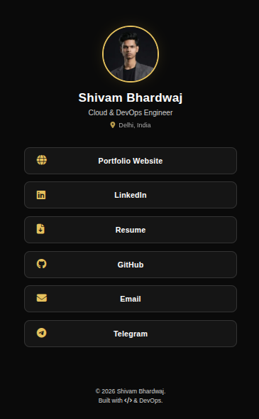

# Personal LinkHub — Cloud Engineer Edition


A high-performance, fully accessible, dark-themed personal landing page built to replace generic services like Linktree. Hosted 100% free on GitHub Pages and engineered for speed.

**🔗 Live Production Demo:** [https://shivam-bhardwaj-cloud.github.io/links/](https://shivam-bhardwaj-cloud.github.io/links/)


## 📸 Preview

---

## 🚀 Why I Built This

As a Linux Administrator and Cloud Engineer, I believe in **owning my infrastructure**. Instead of relying on third-party services that charge for basic customization and control, I built a lightweight, static, data-driven solution from scratch.

### Key Features
* **Zero-Bloat Architecture:** Pure HTML5, CSS3, and Vanilla JS. No React, no heavy frameworks.
* **Data-Driven UI:** Links are rendered dynamically from a single JavaScript array.
* **100/100 Lighthouse Scores:** Optimized with resource preconnecting and high-priority image fetching for blazing-fast load times.
* **Accessible (a11y):** Fully screen-reader compliant with semantic landmarks (`<main>`, `<header>`), `aria-labels`, and hidden decorative elements.
* **Built-in Telemetry:** Custom Google Analytics (`gtag.js`) integration that tracks outbound link clicks as distinct engagement events.

---

## 🛠️ Tech Stack

| Component | Technology | Description |
| :--- | :--- | :--- |
| **Structure** | HTML5 | Semantic markup prioritized for screen readers and SEO. |
| **Styling** | CSS3 | Flexbox, CSS Variables, and conic-gradient glassmorphism effects. |
| **Logic** | JavaScript (ES6+) | Dynamic DOM manipulation and event listener bindings. |
| **Hosting** | GitHub Pages | CI/CD auto-deploy from the `main` branch. |

---

## 📂 Project Structure

```text
├── index.html          
├── style.css
├── script.js
└── assets/
    └── images/
```

## How to Customize for Yourself
This project is open-source. If you want to deploy your own version, follow these steps:

### 1. Clone the repository
```bash
git clone https://github.com/shivam-bhardwaj-cloud/links
```
### 2. Configure Your Links
Open `script.js` and update the `myLinks` array. The UI will automatically generate the buttons, icons, and hover effects.

```JavaScript
const myLinks = [
    { 
        text: "My Portfolio", 
        url: "https://yourwebsite.com", 
        icon: "fa-solid fa-globe" 
    },
    { 
        text: "Email Me", 
        url: "mailto:hello@yoursite.com", 
        icon: "fa-solid fa-envelope",
        email: "hello@yoursite.com" // Triggers the custom CSS hover tooltip
    }
];
```
### 3. Update Analytics (Optional)
If you want to track your own page views and link clicks, replace the Google Tag ID `(G-4Q94BSH31Y)` in the `<head>` of `index.html` with your own Measurement ID.

### 4. Update Assets
Replace `assets/images/profile.webp` with your own **profile picture**.

## 📄 License
This project is open source and available under the MIT License.

© 2026 Shivam Bhardwaj. Built with code, infrastructure, and automation in mind.